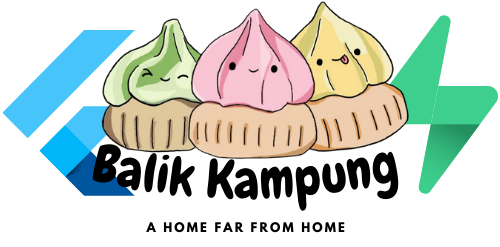

# Balik Kampung
###### Powerpuff bois and Prof Chew | Code Fiesta

A mobile-first solution for creating a home in a place far from home, for Overseas Singaporeans by Singaporeans.

### Problem :frowning:
Being in a foreign land, brings a lot of anxiety and confusion. 

How can we lower the barrier of entry to ease the difficulty in transitioning while having a support structure?

### Target Users :dart:
- Singaporeans who just moved to a new country or staying for a long period of time.

### Pain points to addresses :worried:
- Difficult to make meaningful relationships.

### Goals :star:
- Finding a community who comes from the same culture as you and using that as a launch pad in creating relationships from both within and outside the Singaporean community.
- Locating authentic local Singaporean food, reviewed by true blue Singaporeans for Singaporeans.
- Provide a holistic support structure to ease transistion.

### MVP Features
> :white_check_mark: - Implemented
> :ballot_box_with_check: - To be implemented

##### Auth
:white_check_mark: Login system
:white_check_mark: Email verification system
:white_check_mark: Persist user system
:white_check_mark: Onboarding form
:ballot_box_with_check: Link up with Singpass login API for citizenship verficiation

##### Main Pages
:white_check_mark: Home Page
:white_check_mark: Browse Events Page
:white_check_mark: Browse Community Page
:white_check_mark: Browse Food Page

##### Details Pages
:white_check_mark: Each event page with details
:white_check_mark: Each community page with details
:white_check_mark: Each food review page with details

##### Events
:ballot_box_with_check: Link event location to maps

##### Food
:ballot_box_with_check: Review system with star ratings
:ballot_box_with_check: Link all locations to google maps for offline viewing

##### General 
:white_check_mark: Search by name for all pages
:ballot_box_with_check: Filter by tags

##### Wellness and emergency services
:ballot_box_with_check: Emergency contacts
:ballot_box_with_check: Chat with a therapist from Singapore Association for mental health
